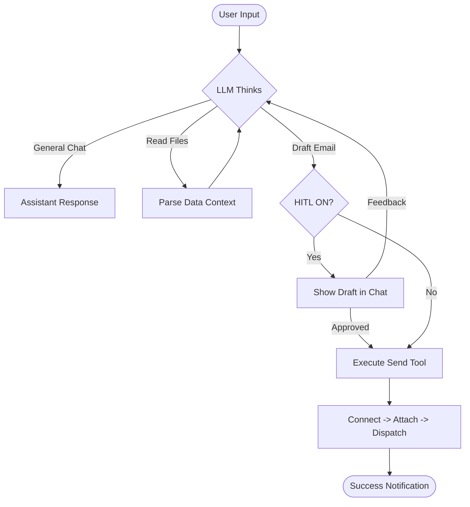

# 📧 Intelligent Conversational Email Agent

A professional-grade, AI-driven automation suite designed to streamline high-volume outreach and personalized communication. This agent leverages the state-of-the-art **ReAct (Reasoning and Acting)** architecture via **LangGraph**, providing a flexible chatbot interface that can read complex data and execute email tasks autonomously.

---

## 🌟 Core Capabilities

- **🧠 Advanced Reasoning:** Unlike rigid templates, the agent understands *intent*. It can summarize research papers, extract contact details from messy CSVs, and draft context-aware emails.
- **💬 Conversational Interface:** A unified chat window powered by **Streamlit**. Talk to the agent like a human assistant to refine drafts or ask questions about your data.
- **📦 Smart Bulk Dispatch:** Upload a list of 100 contacts; the agent can draft personalized messages for all of them and send them in one high-speed batch using optimized SMTP.
- **💾 Long-Term Memory:** Uses a local **SQLite database** to store conversation checkpoints. If you close the app and come back, the agent remembers exactly where you were.
- **🛡️ Multi-Layer Safety:** 
    - **HITL (Human-In-The-Loop):** A switchable guardrail that forces the agent to get your approval in chat before any email leaves your inbox.
    - **Secure Credential Handling:** Passwords and API keys are stored only in memory during the session and are never logged or saved to the database.

---

## 🔄 How the Agent Works (Workflow)

The agent operates in a **Perception-Reasoning-Action** loop. When you send a message, the following happens:

1. **Context Loading:** The agent injects the text from your uploaded "Target Data" files into its current thought process.
2. **Decision Making:** The LLM decides whether it can answer you directly (Chat) or if it needs to use a Tool (Send Email).
3. **Drafting:** If sending an email, it drafts the content based on your instructions and data context.
4. **Approval Loop:** If HITL is enabled, it pauses and shows you the draft. You can chat back to "Refine" it or click "Approve".
5. **Execution:** Once approved, it triggers the SMTP tool, physically attaches your "Email Attachment" files, and sends the mail.

### Workflow Diagram
*(Fixed for compatibility)*



---

## 📧 Critical Step: Getting your Gmail App Password

The agent uses **Standard SMTP** to communicate with Gmail servers. For security, Google blocks regular passwords. You **must** follow these exact steps to get a unique 16-character code:

1.  **Open Google Account:** Go to [myaccount.google.com](https://myaccount.google.com).
2.  **Enable 2FA:** Navigate to **Security** -> **2-Step Verification**. This must be **ON**.
3.  **Find App Passwords:** Scroll to the bottom of the "2-Step Verification" page or search "App Passwords" in the top bar.
4.  **Generate Code:**
    - Choose a name (e.g., "My Email Agent").
    - Click **Create**.
5.  **Secure the Code:** A yellow box will appear with a **16-character code** (e.g., `abcd efgh ijkl mnop`). 
6.  **Paste into Sidebar:** Copy this code (without spaces) and paste it into the **App Password** field in the agent's sidebar.

---

## 🛠️ Setup & Installation

### 1. Requirements
- Python 3.9+
- An API Key from [Sarvam AI](https://dashboard.sarvam.ai/) or OpenAI.

### 2. Installation
```bash
# Clone the repository
cd Email_Agent

# Install dependencies
pip install -r requirements.txt
```

### 3. Run the Agent
```bash
python -m streamlit run app_email.py
```

---

## 📖 Detailed User Guide

### 📂 Upload Section (Sidebar)
The sidebar contains two distinct, optional upload areas:
- **1. Target Data & Context:** Upload your lists (CSV/XLSX), research papers (PDF), or instructions (TXT). The agent **reads** these to understand who to email and what to say. It **does not** attach these to emails.
- **2. Email Attachments:** Upload the actual files (Resume, Portfolio, etc.) that you want the recipient to receive. These are **physically attached** to every email the agent sends.

### 💬 Chat commands (Examples)
- **Batch Outreach:** *"I've uploaded a CSV of 50 professors. Draft a short inquiry for each based on their research area mentioned in the 'Interest' column, then show me the first one."*
- **Refinement:** *"The draft looks good, but please mention my interest in Side-Channel Analysis more specifically."*
- **Single Send:** *"Send a quick thank-you note to nikhil@example.com."*

---

## ⚙️ Technical Stack
- **Framework:** [LangGraph](https://langchain-ai.github.io/langgraph/) (Stateful orchestration).
- **LLM Interface:** [LangChain-OpenAI](https://python.langchain.com/docs/integrations/chat/openai/).
- **Parsing:** `Pandas` (Tabular data), `PyPDF2` (Document extraction).
- **Speed:** Batch processing via `smtplib` connection pooling.

---
*Developed for advanced professional and academic automation.*
