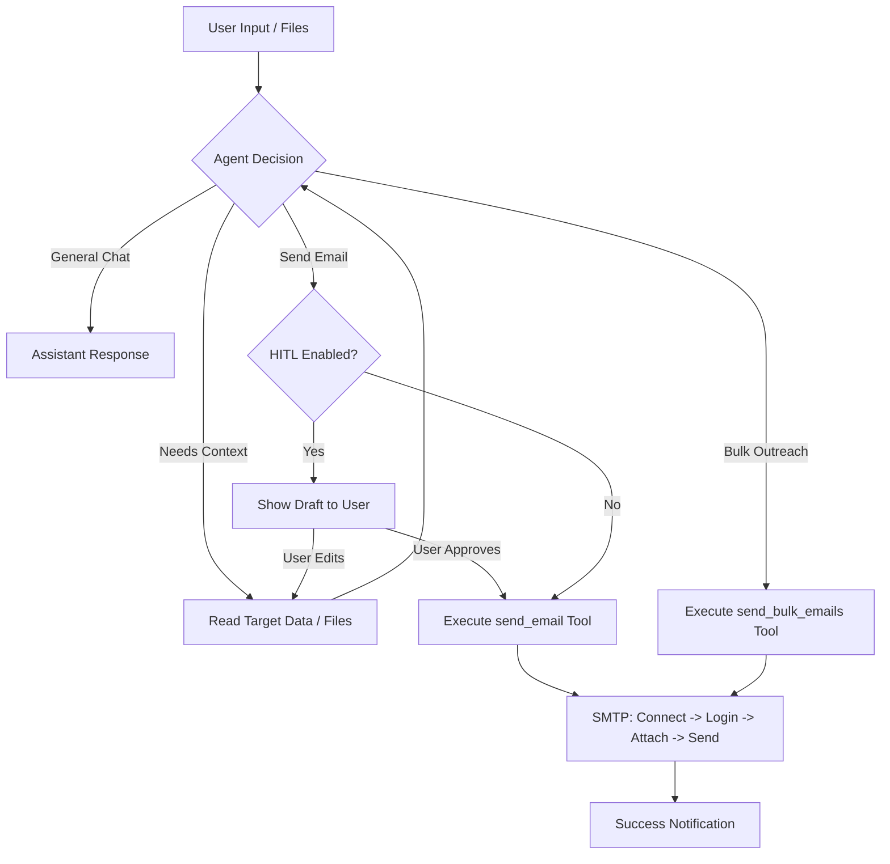

# 📧 Intelligent Email Automation Agent

A sophisticated, conversational AI agent built with **LangGraph** and **Streamlit** that handles everything from general chat to bulk email outreach. Powered by the **Sarvam AI LLM** (or any OpenAI-compatible provider), this agent intelligently reads your data, drafts personalized messages, and sends them with physical attachments.

---

## 🌟 Key Features

- **💬 Conversational ReAct Agent:** Talk to the agent naturally. Ask questions about your data, request summaries, or instruct it to start email campaigns.
- **📊 Bulk Data Processing:** Upload CSV, Excel, PDF, or TXT files. The agent reads and understands the context (e.g., a list of professor contacts or a research paper).
- **📎 Multi-File Attachments:** Separate uploaders for "Target Data" (context) and "Email Attachments" (files physically sent with emails).
- **🚀 Speed Optimized:** Uses a custom `send_bulk_emails` tool that manages a single SMTP connection for multiple recipients, making dispatch vastly faster.
- **💾 Persistent Memory:** Integrated SQLite database (`chat_memory.db`) ensures the agent remembers your instructions and history across sessions.
- **🛡️ Human-In-The-Loop (HITL):** A safety toggle that forces the agent to show you every draft for approval in chat before sending.
- **🔌 Swappable LLMs:** Easily switch between Sarvam AI, OpenAI, or custom local models (Ollama/vLLM) via the UI.

---

## 🔄 Agent Workflow



---

## 🛠️ Installation & Setup

1. **Clone the repository** and navigate to the `Email_Agent` folder.
2. **Install Dependencies:**
   ```bash
   pip install -r requirements.txt
   ```
3. **Launch the Application:**
   ```bash
   python -m streamlit run app_email.py
   ```

---

## 📧 How to get your Gmail App Password

The agent uses **SMTP** to send emails. For Gmail, you cannot use your regular password. You **must** create an "App Password":

1. Go to your [Google Account Security Settings](https://myaccount.google.com/security).
2. Ensure **2-Step Verification** is turned **ON**.
3. Search for **"App Passwords"** in the top search bar.
4. Name it (e.g., "Email Agent") and click **Create**.
5. **Copy the 16-character code** (e.g., `xxxx xxxx xxxx xxxx`).
6. Paste this code into the **App Password** field in the Sidebar of the app.

---

## 📖 User Guide

### 1. Configuration (Sidebar)
- **LLM Provider:** Choose your engine. **Sarvam AI** is recommended for high-performance reasoning.
- **API Key:** Paste your provider's API key.
- **SMTP Credentials:** Enter your email and the 16-character **App Password**.
- **HITL Toggle:** Keep this **ON** if you want to review emails before they are sent.

### 2. Context & Attachments (Sidebar)
- **Target Data:** Upload lists of contacts or context docs (Agent reads these).
- **Email Attachments:** Upload files you want physically sent to recipients.

### 3. Interaction (Main Chat)
- **General Task:** *"How are you?"* or *"What is in the CSV I uploaded?"*
- **Drafting:** *"Draft a professional follow-up for the professors in the list."*
- **Sending:** *"Send the email to nikhil@example.com using the attached paper."*
- **Refinement:** *"Make the tone more casual and mention my B.Tech degree."*

---

## 🗂️ Technical Architecture

- **Orchestration:** `LangGraph` (ReAct Agent architecture).
- **Language Model:** `langchain-openai` (OpenAI-compatible wrapper).
- **Interface:** `Streamlit` (Interactive web UI).
- **Parsing:** `Pandas` (CSVs/Excel), `PyPDF2` (PDFs).
- **Communication:** `smtplib` (Python Standard Library).
- **Storage:** `SqliteSaver` (Persistent checkpointing).

---

## ⚙️ Configuration File (`config.py`)
To add a new LLM provider, simply update the `PROVIDERS` dictionary in `Email_Agent/config.py`. The UI will automatically detect the new option!

---
*Created with ❤️ for efficient academic and professional outreach.*
